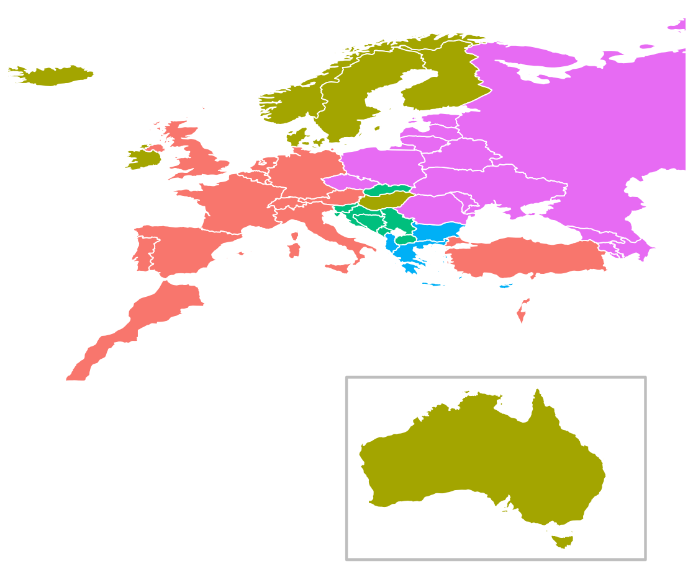

# Introduction 
This repo contains some R scripts to scrape and analyse scoreboards from the ESC.

See also the post on [my blog](http://mildlyscientific.schochastics.net/2017/05/13/blockvoting-in-the-eurovision-song-contest/)
# Blockvoting

